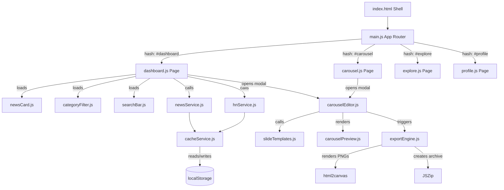
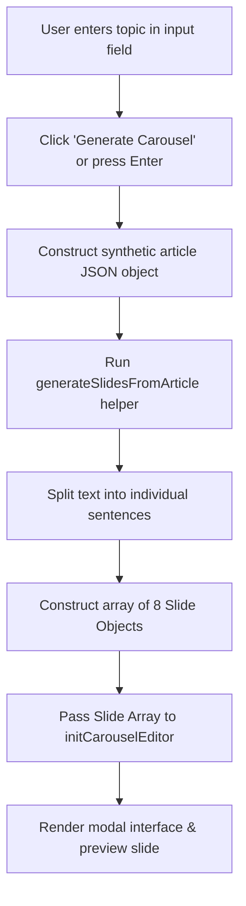
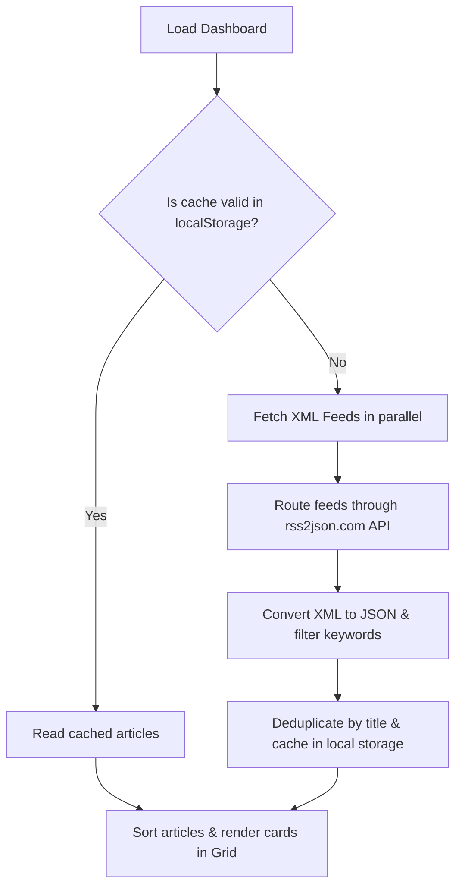
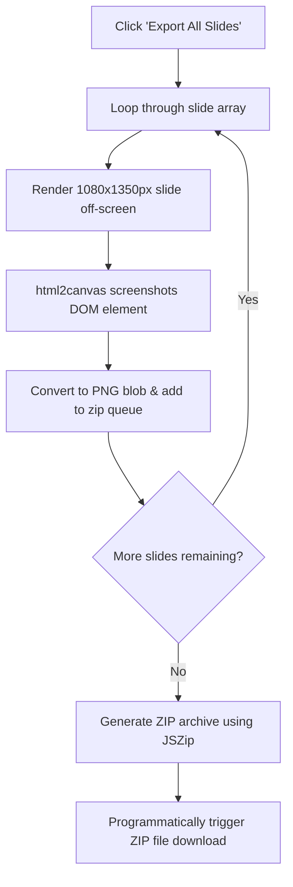

# 🧠 CarouselCraft AI — Instagram Studio & News Hub

Welcome to **CarouselCraft AI** (also known as **InstaAI Studio**)! This is a premium, full-fledged web application built specifically for **Tashneet Kaur (@tshntkaur)**. 

It is designed to be your personal command center: it aggregates live artificial intelligence news, hosts your research portfolio, teaches core machine learning concepts, and—most importantly—**automatically generates stunning, Meta AI-style Instagram carousels** from any news article or custom topic.

---

## 📖 What Does This App Do? (The Big Picture)
As a content creator and researcher, you want to share AI updates and teach concepts without spending hours designing slides in Canva. 

**CarouselCraft AI** automates this entire process:
1. **Find Content**: Read live articles fetched from top tech portals or type a topic in the **"Today's Topic"** generator box.
2. **Auto-Structure**: The app takes the text, splits it into logical sentences, and structures it into a **8-slide narrative** (Cover → Context → Deep Dive → Bullet Points → Why It Matters → Real-World Uses → Takeaway → Call To Action).
3. **Style & Edit**: You pick one of **6 premium visual templates** (frosted glass, dark space, minimal Meta AI style), adjust the text in real-time, change slide order, or pick custom colors.
4. **Export**: Click one button, and the app screenshots your slides at a perfect **1080×1350px resolution** (Instagram's carousel standard) and downloads them in a single `.zip` file, ready to post!

---

## 🛠️ The Tech Stack (Under the Hood)
We built this app using a **clean, lightweight, and modern frontend stack** so it runs lightning-fast and has zero server maintenance costs.

*   **Vite**: The build tool and bundler. Think of Vite as the engine that runs our local development server, manages imports, and compiles our code into super-compressed HTML/CSS/JS files when we build for production.
*   **Vanilla JavaScript (ES6 Modules)**: No heavy frameworks like React or Angular. We write clean, modular JS files. Each file has a single responsibility (e.g., rendering cards, fetching feeds) and imports what it needs using `import/export` statements.
*   **Vanilla CSS (Claude-style Product Design)**: Pure CSS using custom properties (variables) for colors and fonts. We designed it with a **warm light mode (beige/cream)** inspired by Anthropic's Claude UI, utilizing clean cards, elegant borders, and soft shadows.
*   **Google Fonts**:
    *   *Lora*: A beautiful serif font used for headers to give the app a premium, editorial, and academic feel.
    *   *Inter*: A clean, highly readable sans-serif font for body text and settings.
*   **html2canvas**: A library that reads our HTML elements (the slides), draws them onto an invisible canvas in the browser, and converts them into high-resolution PNG image files.
*   **JSZip**: A library that takes the individual PNG slide files, packs them into a single compressed `.zip` archive, and downloads it to your computer.

---

## 🔄 User Flows & Architecture Diagrams

### 1. Core Application Architecture Flow
This diagram shows how the pages, components, and data services interact:



### 2. "Today's Topic" Generator Flow
Type any custom topic on the dashboard, and the generator builds an 8-slide deck:



### 3. RSS News Feed Aggregation Flow
How the app fetches, categorizes, and caches live AI news:



### 4. Slide Generation & ZIP Export Flow
The pipeline that converts HTML elements to downloadable PNG images:



---

## 📂 Code Directory Structure (For a 1st Year Student)

Here is a simple explanation of where every file lives and what it does:

```
ai-news-hub/
├── index.html                  # The entry HTML shell containing placeholders for pages and modals
├── style.css                   # The global style sheet (CSS variables, layout, animations, slide styles)
├── package.json                # Project config file listing Vite, html2canvas, and jszip dependencies
└── src/
    ├── main.js                 # App entry point: registers the SPA router and sets up global modals/toasts
    ├── data/
    │   ├── feedSources.js      # List of RSS feeds URLs and categories (LLMs, Agents, Startups)
    │   ├── profile.js          # Tashneet's academic profile (Bio, Publications, CV, Awards)
    │   └── sampleNews.js       # Fallback news articles used if the RSS API goes down
    ├── services/
    │   ├── newsService.js      # Fetches XML feeds, converts to JSON via rss2json API, and normalizes schema
    │   ├── hnService.js        # Fetches top AI stories from Hacker News using their Algolia API
    │   └── cacheService.js     # Manages localStorage cache (saves feed data for 1 hour to prevent API spam)
    ├── utils/
    │   ├── helpers.js          # Text truncation, date formatting, HTML escaping, and debounce functions
    │   └── animations.js       # IntersectionObserver for fade-in animations on scroll
    ├── components/
    │   ├── navbar.js           # Navigation bar controller (handles page tabs and mobile hamburger menu)
    │   ├── newsCard.js         # Renders the news cards seen on the dashboard
    │   ├── categoryFilter.js   # Renders the category tag filters
    │   ├── searchBar.js        # Renders the debounced news search input
    │   ├── slideTemplates.js   # The SLIDE CREATOR. Defines templates (Nebula, Midnight) & splits articles into slides
    │   ├── carouselPreview.js  # Displays the slide inside the editor, scaled to fit using CSS transforms
    │   ├── exportEngine.js     # Screenshots DOM slides as PNGs using html2canvas & bundles into a ZIP
    │   └── carouselEditor.js   # Main slide editor modal (handles text edits, template picker, add/delete slides)
    └── pages/
        ├── dashboard.js        # Logic for the homepage (loads news, handles modal popups)
        ├── carousel.js         # Custom slide generator form & template showcase
        ├── explore.js          # Learning tracks section (AI Fundamentals, AI Agents)
        └── profile.js          # Renders Tashneet's academic CV, publications, and thesis
```

---

## 🎨 Slide Design Templates
Inside the editor, you can switch between 6 templates:
1.  🌌 **Nebula**: Frosted-glass cards centered on a deep indigo-violet cosmic gradient.
2.  ⚡ **Electric**: Cyberpunk style with neon blue accent borders, high contrast, and clean sans-serif text.
3.  🔥 **Meta AI**: Clean, flat white/gray aesthetic resembling official announcements from Meta.
4.  🧊 **Frost**: Ice-cold light mode with soft shadows and frosted card details.
5.  🌈 **Gradient Flow**: Full-bleed modern color gradient backgrounds for maximum vibrancy.
6.  🖤 **Midnight**: Pure black background with a premium gold gradient border (excellent for showcasing publications).

---

## 💻 How to Run Locally

### Prerequisites
Make sure you have **Node.js** (v18 or higher) installed on your computer.

### Setup Instructions
1.  Download or clone the repository to your computer.
2.  Open your terminal/PowerShell, navigate to the folder, and install the dependencies:
    ```bash
    npm install
    ```
3.  Start the local development server:
    ```bash
    npm run dev
    ```
4.  Open your browser and navigate to **`http://localhost:5173/`** to interact with the application.

---

